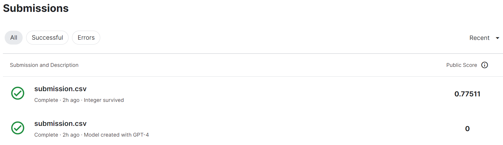
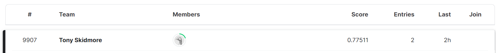

# Titanic Survival Prediction Machine Learning Model

- [Overview](#overview)
- [Titanic Survival Machine Learning Model](#titanic-survival-machine-learning-model)
  - [Training](#training)
  - [Inferencing](#inferencing)
  - [Online Scoring](#online-scoring)
- [GPT-4 prompts](#gpt-4-prompts)
- [Result](#result)

### Overview

There is a [Titanic - Machine Learning from Disaster](https://www.kaggle.com/competitions/titanic/overview)
competition on Kaggle to create a model to see how well you can do at predicting survival based on available data.  

I am not a data scientist (as you might be able to deduce) but I have been working in an Azure ML environment
for around a year, so that has piqued my interest in AI.  I have been trying to learn as much as I
can on the subject, but had no previous knowledge of AI or Machine Learning.  The invent of ChatGPT opens up a whole
new world of learning opportunities, so this repo was experimentation into what could be achieved without the
pre-requisite data science skills to create a model that could produce output to allow a submission to the competition.  

You could say this is cheating, you are just the copying and pasting code to get a result, which is partly right.
But there is an overall contextual learning opportunity in using this method, in that from only understanding the requirement,
you are able to get working output that you can then drill into to understand the generated solution.  

For example:

`Me:`  
`"X_train, X_val, y_train, y_val = train_test_split(X, y, test_size=0.2, random_state=42)`
 explain this code in words a 15 year old would understand

`ChatGPT:`  
> This code is dividing a dataset into two parts: one part is going to be used to train a machine learning model, and the other part is going to be used to evaluate how well the model performs.
>
> The dataset is represented by two matrices: **X** (which contains the features or input variables) and **y** (which contains the target or output variable). In this case, the dataset represents information about passengers on the Titanic, and the target variable is whether or not each passenger survived the sinking.
>
> The **train_test_split** function takes in these two matrices (**X** and **y**) and splits them into four new matrices: **X_train**, **X_val**, **y_train**, and **y_val**. The function randomly assigns each row of the original dataset to either the training set or the validation set.
>
> The **test_size=0.2** argument tells the function to assign 20% of the original dataset to the validation set, meaning that the remaining 80% of the data will be used to train the model.
>
> The **random_state=42** argument ensures that the data is split in the same way each time the code is run, which allows us to reproduce the same results if we need to.
>
> Once the data is split into **X_train**, **X_val**, **y_train**, and **y_val**, we can use **X_train** and **y_train** to train a machine learning model, and **X_val** and **y_val** to evaluate how well the model performs on new data that it has not seen before.

_Note:_ The [Titanic Tutorial](https://www.kaggle.com/code/alexisbcook/titanic-tutorial) provides the classic way to develop the machine learning model for this challenge.

### Titanic Survival Machine Learning Model

The below sections explain how to train the model, save it to disk and then use it to predict a result based on input data.

#### Training

Download the [titanic dataset](https://www.kaggle.com/c/titanic/data) from [Kaggle](https://www.kaggle.com/) - register for free

All of the below instructions are based
on my development environment of Windows Subsystem for Linux running Ubuntu 20.04.
You may need to adapt the instructions for your environment.  

Create a Python virtual environment.

````bash

mkdir -p ~/venvs
python3 -m venv ~/venvs/titanic-model
source  ~/venvs/titanic-model/bin/activate
pip install pip setuptools --upgrade

````

Clone this repo and install the required Python libraries:

````bash

git clone https://github.com/tonyskidmore/titanic-ml-model.git
cd titanic-ml-model

pip install -r requirements.txt

````

Copy `test.csv` and `train.csv` from the Titanic dataset .zip to the `titanic-ml-model` directory.  

Run the training script:

````bash

python3 ./train.py

````

This produces the `model.joblib` file, which is the machine learning model stored to disk.

#### Inferencing

Inferencing refers to the process of making predictions using a trained machine learning model. This involves feeding new, unseen data into the model and having it output predictions or inferences based on the learned patterns.

Now that the model has been trained and saved to disk it can be used for prediction.

To do that we run the `inference.py` python script:

````bash

python3 inference.py

# or score with alternate data:

python3 inference.py data_2.json

````

#### Online Scoring

Scoring is the process of evaluating the quality or accuracy of the predictions made by the machine learning model. This often involves comparing the predicted values against actual known values (ground truth) and computing various metrics like accuracy, precision, recall, F1 score, etc.

In our example we will use the `score.py` as part of a process to host an online endpoint of our model
that we can send data to via a HTTP request.  For this we will use the Microsoft 
[azureml-inference-server-http](https://learn.microsoft.com/en-us/azure/machine-learning/how-to-inference-server-http)
Python package.  

To create the online endpoint run the following in the `titanic-ml-model` directory:

````bash

azmlinfsrv --entry_script ./score.py --model_dir ./

````

In a separate console window send data to the online endpoint, for example using `curl`:

````bash

cd titanic-ml-model
response=$(curl --silent \
     --show-error \
     --request POST "127.0.0.1:5001/score" \
     --header 'Content-Type:application/json' \
     --data @data_1.json)

# Note: requires jq installed
prediction=$(jq -r .prediction <<< "$response")

if [[ "$prediction" == "1" ]]
then
    echo "Passenger Survived"
elif [[ "$prediction" == "0" ]]
then
  echo "Passenger did not Survive"
else
  echo "Invalid response"
fi


````

### GPT-4 prompts

In total I used the following prompts to GPT-4 to get to the point where I could submit a competition submission to Kaggle:

* _based on the titanic CSV data, can you create a machine learning model to determine if a passenger was likely to survive?_
* _can you show me how to do this in Python?_
* _how do I save the model to a file?_
* _how do i convert the survived column to an integer?_
* _how can I improve the success rate of the model?_
* _can you show me in Python how I can make success rate improvements?_
* _how do I know what inputs to pass to the model?_

_Note:_ Some of the prompts were just used for additional information
and the output not incorporated into the code.

### Result

The code in this repo is the result of the output from the above prompts.
The training and test data is not included, as you will need to get that from
[Kaggle](https://www.kaggle.com/c/titanic/data).

The first submission I did had a zero score, which didn't seem right because even
if the model was rubbish the law of averages should suggest some kind of result above zero.
This is the reason for the __how do i convert the survived column to an integer?__ prompt.



After fixing that issue and resubmitting I was very pleased to see a score of **0.77511**,
putting me in a position of **9907** out of **16324** contenders on the [leaderboard](https://www.kaggle.com/competitions/titanic/leaderboard?search=skidmore) (at time of writing).
I know this isn't a great result, but it is a start and produced what I set out to achieve.



Maybe I am a being a bit of a charlatan to feel a sense of achievement by using AI to get the result, but
on the other hand I have been using Google for years to achieve the same ends.  So no,
I am counting it as a new skill 😜.

The initial inspiration for using the Titanic example came from watching another great [YouTube video](https://www.youtube.com/watch?v=Ebb4gUI2IpQ&t=90s) from [Nicholas Renotte](https://github.com/nicknochnack).
